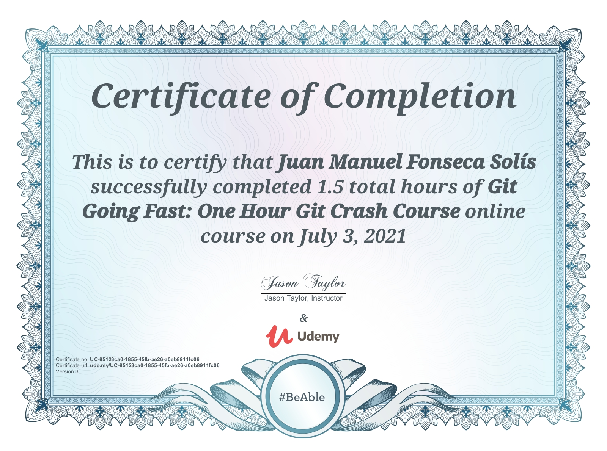

# gitTaylorCourse-gl
Repository for uploading the assignments of the course https://gorillalogic.udemy.com/course/git-going-fast

## 1 Pre-requisites
```
sudo apt-get install git
which git
git version
```

## 2 Project set-up
```
git init <projectName> (this creates a .git folder)
git config --global user.name "Juan Fonseca"
git config --global user.email "juan.fonsecasolis@myAwesomeDomain.com"
git config --global --list
```

## 3 Run
None

## 4 Theory

### 4.1 Git staging


Figure taken from https://static.javatpoint.com/tutorial/git/images/git-index.png.

### 4.2 Commands
* List all GIT commands: `git help`
* Help for a specific GIT command: `git help <specific command>` 

#### Add/commit changes
* Add files (stage) `git commit -m "<comments here>"`
* Add already existing files: `git commit -am "<comment here>"`
* Add new files recursively: `git add .`
* Add single files: `git <file here>`

#### Revert/unstage changes
* Revert changes on a file: `git restore <filename>` 
* Remove file from a commit (called unstage): `git reset HEAD <fileToBeReverted>`

#### Logs
* See commits made to origin `git log` 
* See logs in a simplified way `git log --oneline --graph --decorate --color`

#### Delete
* Option 1: use `git rm <filename>`
* Option 2: remove file without using git `rm <filename>`, then use `git add -u` to let GIT put the `git rm` automatically (useful when you have a lot of deletions) 

#### Move files
* Use `git mv <originPath> <targetPath>`

#### Ignore files
* Included the file name or extension in `.gitignore`

#### SSH
* Create a new key: `cd ~/.ssh; ssh-keygen -t rsa -C "yourEmailAddress"`
* Vefify SSH authentication:`ssh -T git@github.com`

#### Link an existing local repository with a Github repository
```
git remote add origin git@github.com:<nameOfTheRepository.git>
```

#### Others
* List Git's remotes: `git remote -v`
* Let the master branch know that it should push to the recently added repository:
```
git push -u origin master
```
* It is a good practice to do a pull before doing a push to get other developer's changes

### 4.3 Certificate of completition


## Author
2021 Juan Fonseca. 
